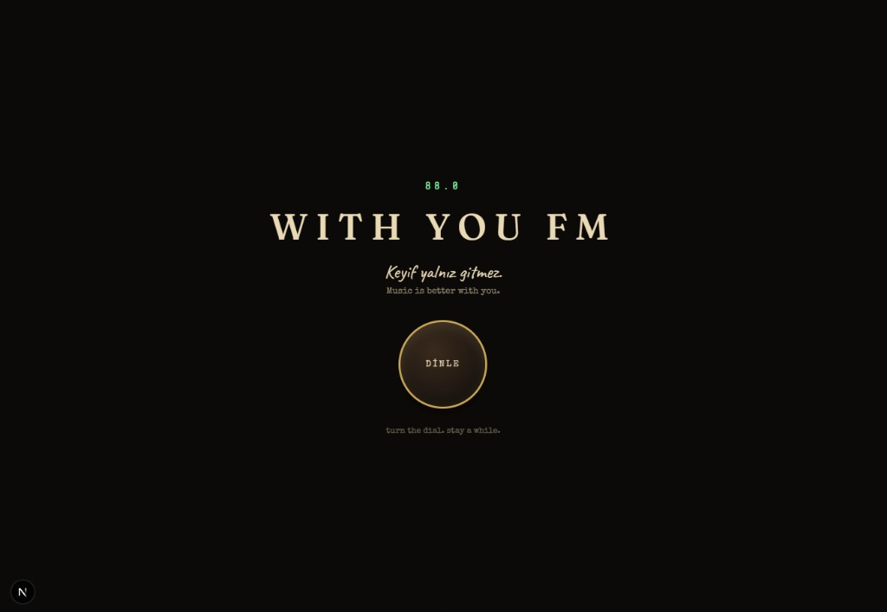
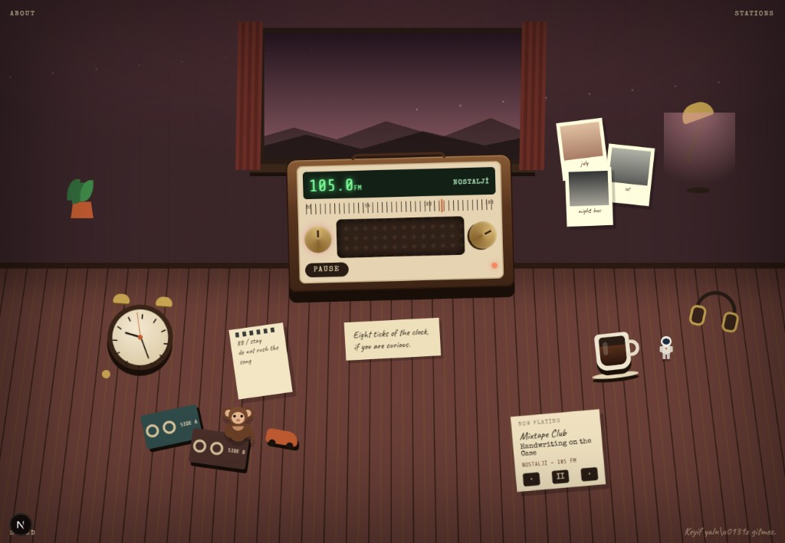

# WITH YOU FM

**Keyif yalniz gitmez.**  
Music is better with you.

This project is a salute to an old internet radio that felt like a room, not a website.

Years ago, [Bira FM](https://www.behance.net/gallery/46355305/Bira-FM-Keyif-Yalniz-Gitmez) put a vintage radio, a clock, a monkey, and a whole desk into the browser. You did not open a playlist. You sat down. You turned a dial. Songs arrived with mood, static, and small toys that lived on the table.

WITH YOU FM is our way of standing up for that idea.

We kept the feeling: curiosity, warmth, a handmade Flash-era world, and the line that still holds the whole thing together.

Source, with respect:

**[Bira FM // Keyif Yalniz Gitmez — Behance](https://www.behance.net/gallery/46355305/Bira-FM-Keyif-Yalniz-Gitmez)**

---

## Why we built it

The original site is gone from daily life, but the memory is not. Most music websites today are dashboards. Cards. Buttons. Queues.

Bira FM was the opposite. It was a small world you entered. Frequency was a mood. The desk was the navigation. Hidden clicks were the reward for staying.

We wanted that experience to exist again, under a new name, without alcohol, and with room to grow.

---

## What we made

A dark, quiet door. Then a room.

The first screen is only a frequency, a name, a promise, and a round **DINLE** button. No menu. No hero grid. You press listen, the radio wakes up, and the desk appears.

<p align="center">
  
</p>

<p align="center"><em>The door. Tuning glow, cream type, one dial.</em></p>

Inside, the viewport is the room. A window, a wooden floor, a vintage radio in the center. Around it: clock, coffee, cassettes, polaroids, headphones, a plant, a monkey, a tiny astronaut, paper notes. The radio is how you change stations. The objects are how you stay.

<p align="center">
  
</p>

<p align="center"><em>The room. The environment is the player.</em></p>

What that means in practice:

- Eight mood stations, plus a hidden ninth.
- A tuning dial with analog static between frequencies.
- The window and lighting change with the station.
- A coffee cup instead of the old drinking object. Hold it. Steam moves.
- A monkey that walks, sits, sleeps, hides, and sometimes runs away.
- An astronaut that appears rarely.
- Draggable objects that remember their place for the session.
- Small easter eggs, because the old site rewarded clicking around.

The music here is original synthesized demo loops, not commercial tracks. The point of this version is atmosphere and interaction first.

---

## Run

```bash
cd C:\Users\gorke\projects\with-you-fm
npm install
npm run dev
```

Open [http://localhost:3000](http://localhost:3000).

```bash
npm run build
npm start
```

Regenerate prototype audio:

```bash
npm run generate-audio
```

## How to listen

1. Wait through the tuning screen.
2. Click **DINLE**.
3. Drag the radio dial. Static lives between stations.
4. When a frequency locks, the room and the playlist change.

Drag the desk if you want. Stay a while.

## Stations

| FM  | Name     | Mood        |
| --- | -------- | ----------- |
| 88  | EVDE TEK | Quiet night |
| 91  | GECMISTE | In the past |
| 94  | YAGMUR   | Rain        |
| 97  | GECE     | Night       |
| 100 | YOLDA    | On the road |
| 103 | MUTLU    | Happy       |
| 105 | NOSTALJI | Nostalgia   |
| 108 | SAKIN    | Calm        |
| 111 | GIZLI    | Hidden      |

111 FM stays quiet until you find it.

Add later stations in `src/data/stations.ts`.

## Hidden things

- Click the monkey five times.
- Click the astronaut.
- Click the clock eight times.
- Drag the radio.
- Click the coffee ten times. Hold the cup to change the level.
- Click the plant.
- Sit still for a minute. Sit still a little longer.

## Stack

Next.js, TypeScript, React, Framer Motion, Howler.js.

| Path | Role |
| --- | --- |
| `src/data/stations.ts` | Stations and copy |
| `src/systems/AudioSystem.ts` | Music, ambience, effects |
| `src/systems/RadioSystem.ts` | Frequency locking |
| `src/systems/SceneSystem.ts` | Atmosphere |
| `src/systems/CharacterSystem.ts` | Monkey behaviors |
| `src/context/WorldContext.tsx` | Room state |
| `src/components/room/RoomScene.tsx` | Illustrated desk |
| `public/audio/` | Generated demo audio |
| `docs/` | README images |

---

WITH YOU FM is not a clone of Bira FM.

It is a thank you, left on the desk.
